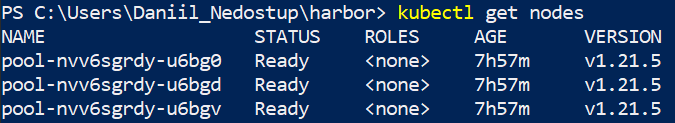

# Deploying Harbor with High Availability via Helm

https://www.digitalocean.com/community/pages/kubernetes-challenge<br>

----

_Description: goal of the project is deploy an internal container registry - Harbor (https://goharbor.io/)_ <br>

**Harbor registry**: https://161.35.246.128/<br>
**Small demo**: https://youtu.be/5RUyTMY4QlQ <br>

## Steps involved to complete the challenge:<br>

- Creating the kubernetes cluster on Digital Ocean<br>
- Deploy and configure Harbor Helm chart<br>
- Testing the result (+ small demo)<br>

----

## Creating the kubernetes cluster on Digital Ocean

My cluster consists of 3 nodes.<br>
Get the cluster ID:<br>
```
doctl kubernetes cluster list
```
Apply kubeconfig by ID:<br>
```
doctl kubernetes cluster kubeconfig save <cluster_id>
```
Check the cluster status:<br>
```
kubectl get nodes
```


----

## Deploy and configure Harbor Helm chart <br>

Download harbor Helm chart:<br>

```
helm repo add harbor https://helm.goharbor.io
helm fetch harbor/harbor --untar
```
Edit certain fields in **values.yaml**: <br>

```
expose:
  type: loadBalancer
  tls:
    enabled: true
    certSource: auto
    auto:
      commonName: "161.35.246.128"
  loadBalancer:
    name: harbor
    IP: "161.35.246.128"
externalURL: https://my.local.harbor
```

Install chart:
```
helm install -n harbor harbor .
```
Check the status:
```
kubectl get pods -n harbor
```


Go to https://161.35.246.128 or https://my.local.harbor and log in:
```
Login: admin
Password: Harbor12345
```


Create a project:


Set Up certificate:

```
openssl s_client -connect my.local.cluster:443
```
Copy certificate to ca.crt:
```
-----BEGIN CERTIFICATE-----
MIIC6TCC...
-----END CERTIFICATE-----
```

Apply cert (Windows method):
```
- Start > "Manage Computer Certificates" (also available in the control panel)
- Right-click on "Trusted Root Certification Authoritites" > "All tasks" > "Import"
- Browse to the crt file and then keep pressing "Next" to complete the wizard
- Restart Docker for Windows
```
Add exception to docker desktop:<br>


-----
## Testing the result (+ small demo)

**YouTube small demo here ->** <br>

Use Harbor as an internal registry:<br>
```
docker login my.local.harbor
```
or<br>
```
docker login 161.35.246.128
```
Pull nginx for example:<br>
```
docker pull nginx
```
Tag the nginx image:<br>
```
docker tag nginx:latest my.local.harbor/daniil/nginx:v2 

```
\* where 'daniil' is Harbor project

Push image to Harbor registry:
```
docker push my.local.harbor/daniil/nginx:v2
```
Check the result in Harbor project: <br>


### Congratulations! You have a Harbor registry! 😄
----
## Useful links:
- https://docs.digitalocean.com/products/kubernetes/
- https://www.digitalocean.com/community/tech_talks/getting-started-with-kubernetes-on-digitalocean
- https://goharbor.io/docs/2.4.0/install-config/harbor-ha-helm/
-
